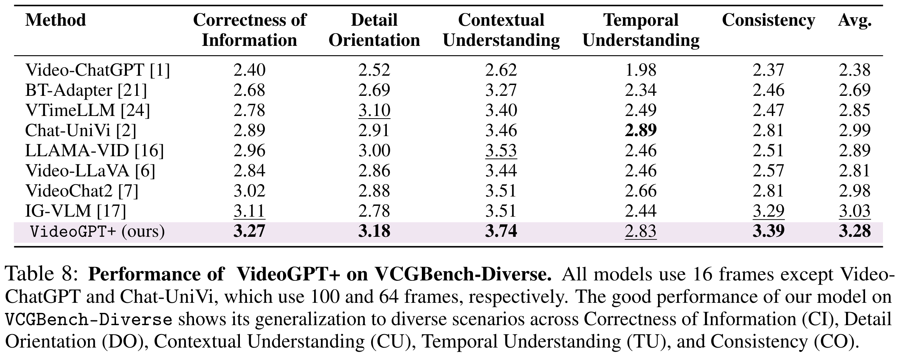
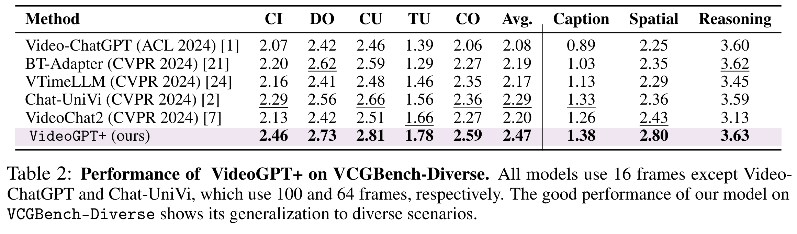
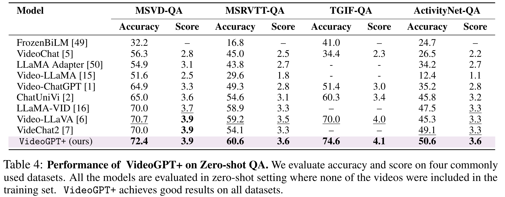
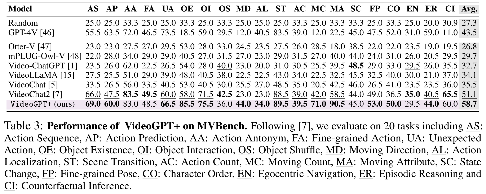

# ReadMe

==========================================================

Qwen2.5 - 3B 实验

下载 [qwen3b](https://huggingface.co/Qwen/Qwen2.5-3B-Instruct) (Qwen/Qwen2.5-3B-Instruct) 权重到 .cache/qwen2_5

预训练的 projector 权重 已上传 [Wangxc1000/qwen2.5_3B_projectors](https://huggingface.co/Wangxc1000/qwen2.5_3B_projectors)


==========================================================

预训练数据及脚本

+ 数据：在下载[instruction_tuning](https://huggingface.co/datasets/MBZUAI/VideoGPT-plus_Training_Dataset)数据时，包含了预训练的图片数据,在pretrain文件夹中，解压即可（这次没删数据）

+ 脚本
```
bash  scripts/pretrain_projector_image_encoder.sh

bash  scripts/pretrain_projector_video_encoder.sh
```
```
VideoGPT-plus
├─ .cache
│  ├─ instruction_data
│     ├─ pretraining
│        ├─ COCO
│        ├─ cc3M
```

==========================================================

EXP. VideoGPT+ 在不同pool上表现 llm使用 qwen2.5 1.5B/~~3B~~

代码 [https://github.com/NIneeeeeem/VideoGPT-tokenadapter.git](https://github.com/NIneeeeeem/VideoGPT-tokenadapter.git)

关于数据下载 : [huggingface]

MBZUAI/VideoGPT-plus_Training_Dataset 【包含了videos和原本的annotions】

OpenGVLab/MVBench 【包含MVBENCH标注和视频】

模型权重下载 : [huggingface]

openai/clip-vit-large-patch14-336

OpenGVLab/InternVideo2-Stage2_1B-224p-f4

Qwen/Qwen2.5-1.5B-Instruct

Wangxc1000/qwen2.5_1.5B_projectors  [projector权重新版]

~~Wangxc1000/Training_caps_data 【正在上传】包含caption标注的信息~~

```python
export HF_ENDPOINT=https://hf-mirror.com
bash hfd.sh MBZUAI/VideoGPT-plus_Training_Dataset
```

关于环境配置：

torch 实验室 2.4.0+cu118

需要单独下载 flash-attn ~~（实验室版本2.6.3）~~ pip install flash-attn --no-build-isolation

其他 pip install -r requirements.txt 即可

Pretrain 脚本在

scripts/pretrain_projector_image_encoder.sh

scripts/pretrain_projector_video_encoder.sh

已确定 VideoGPT+ 的bs设置为256

训练脚本位置 scripts/pool_full

需要修改  export PYTHONPATH="/hhd2/wxc/VideoGPT-plus:$PYTHONPATH”

pool 实现逻辑：

```bash
def divide_and_round(a, b):
            result = a / b
            if result < 1:
                return 1
            else:
                return round(result)
video_feature: shape=(divide_and_round(16, pool_level), divide_and_round(16, pool_level)))
image_feature: shape=(divide_and_round(24, pool_level), divide_and_round(24, pool_level))
```

pool1 即 b=1 表示不进行 pool

测试脚本位置 scripts/eval_pool_full

【代码待修改，预计下午改完】


## Installation :wrench:

We recommend setting up a conda environment for the project:
```shell
conda create --name=videogpt_plus python=3.11
conda activate videogpt_plus

git clone https://github.com/mbzuai-oryx/VideoGPT-plus
cd VideoGPT-plus

pip install torch==2.1.2 torchvision==0.16.2 --index-url https://download.pytorch.org/whl/cu118
pip install transformers==4.41.0

pip install -r requirements.txt

export PYTHONPATH="./:$PYTHONPATH"
```
Additionally, install [FlashAttention](https://github.com/HazyResearch/flash-attention) for training,
```shell
pip install ninja

git clone https://github.com/HazyResearch/flash-attention.git
cd flash-attention
python setup.py install
```
---

## Quantitative Evaluation 📊
We provide instructions to reproduce VideoGPT+ results on VCGBench, VCGBench-Diverse and MVBench. Please follow the instructions at [eval/README.md](eval/README.md).

### VCGBench Evaluation: Video-based Generative Performance Benchmarking :chart_with_upwards_trend:
<p align="center">
  
</p>

---
### VCGBench-Diverse Evaluation :bar_chart:
<p align="center">
  
</p>

---
### Zero-Shot Question-Answer Evaluation :question:
<p align="center">
  
</p>

---

### MVBench Evaluation :movie_camera:
<p align="center">
  
</p>

---

## Training :train:
We provide scripts for pretraining and finetuning of VideoGPT+. Please follow the instructions at [scripts/README.md](scripts/README.md).

---

## Qualitative Analysis :mag:
A comprehensive evaluation of VideoGPT+ performance across multiple tasks and domains.
<p align="center">
  
</p>

---

<p align="center">
  
</p>


<p align="center">
  
</p>

---

## Acknowledgements :pray:

+ [Video-ChatGPT](https://github.com/mbzuai-oryx/Video-ChatGPT): A pioneering attempt in Video-based conversation models.
+ [LLaVA](https://github.com/haotian-liu/LLaVA): Our code base is build upon LLaVA and Video-ChatGPT.
+ [Chat-UniVi](https://github.com/PKU-YuanGroup/Chat-UniVi): A recent work in image and video-based conversation models. We borrowed some implementation details from their public codebase.

## Citations 📜:

If you're using VideoGPT+ in your research or applications, please cite using this BibTeX:
```bibtex
@article{Maaz2024VideoGPT+,
    title={VideoGPT+: Integrating Image and Video Encoders for Enhanced Video Understanding},
    author={Maaz, Muhammad and Rasheed, Hanoona and Khan, Salman and Khan, Fahad Shahbaz},
    journal={arxiv},
    year={2024},
    url={https://arxiv.org/abs/2406.09418}
}

@inproceedings{Maaz2023VideoChatGPT,
    title={Video-ChatGPT: Towards Detailed Video Understanding via Large Vision and Language Models},
    author={Maaz, Muhammad and Rasheed, Hanoona and Khan, Salman and Khan, Fahad Shahbaz},
    booktitle={Proceedings of the 62nd Annual Meeting of the Association for Computational Linguistics (ACL 2024)},
    year={2024}
}
```

## License :scroll:
<a rel="license" href="http://creativecommons.org/licenses/by-nc-sa/4.0/"></a><br />This work is licensed under a <a rel="license" href="http://creativecommons.org/licenses/by-nc-sa/4.0/">Creative Commons Attribution-NonCommercial-ShareAlike 4.0 International License</a>.


Looking forward to your feedback, contributions, and stars! :star2:
Please raise any issues or questions [here](https://github.com/mbzuai-oryx/VideoGPT-plus/issues). 


---
[](https://www.ival-mbzuai.com)
[](https://github.com/mbzuai-oryx)
[](https://mbzuai.ac.ae)